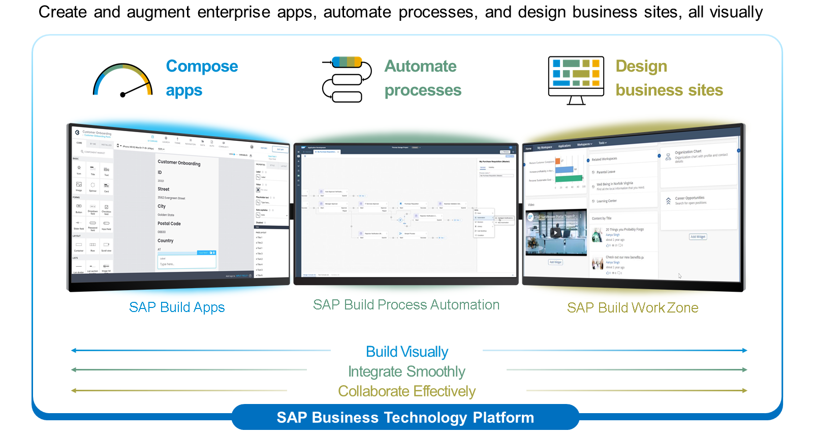
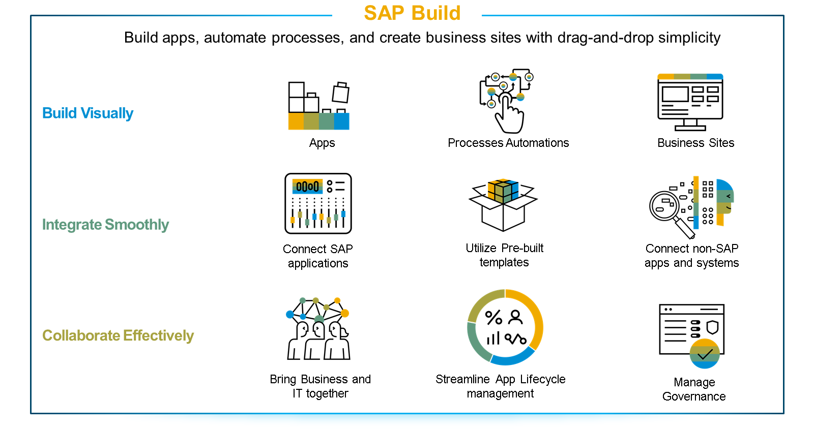

# sap-build-workzone
"SAP Certified Application Associate - SAP Build Work Zone - Implementation and Administration" roadmap.
Check the original repo: [Implementing and Administering SAP Build Work Zone](https://learning.sap.com/learning-journeys/implement-and-administer-sap-build-work-zone).

## What is SAP Build Work Zone?
SAP Build Work Zone enables you to easily build business sites that provide centralized access to business applications and information on any device. Learn how you can create business sites using pre-built templates, user interface cards, and content widgets to help you easily build and manage sites visually.

## SAP´s Build Portfolio
The SAP Build portfolio combines SAP low-code solutions, which enable users of all skill levels to easily create and augment business applications.

The unified low-code solution portfolio empowers users to create applications, automate tedious processes, and design engaging business sites with drag and drop simplicity.

Pro-developers and line of business developers can:

- Build visually with drag and drop simplicity and libraries of prebuilt business content.
- Integrate smoothly with SAP and non-SAP systems.
- Collaborate effectively bringing together businesses and developers, to work in fusion teams.

SAP Build Work Zone is part of the SAP Build Family:

With SAP Build Work Zone, you can create and augment enterprise apps, automate processes, and design business sites, all visually.

SAP Build brings together SAP Build Apps, SAP Build Process Automation, and SAP Build Work Zone, into a unified development experience with new innovations to rapidly build apps, automate processes, and create business sites. Developers can integrate smoothly with SAP and non-SAP applications, and leverage hundreds of prebuilt processes, bots, and UX components, to unify business data and processes. Business and IT can collaborate effectively as fusion teams with drag and drop simplicity, and governance built-in throughout the application development lifecycle.

